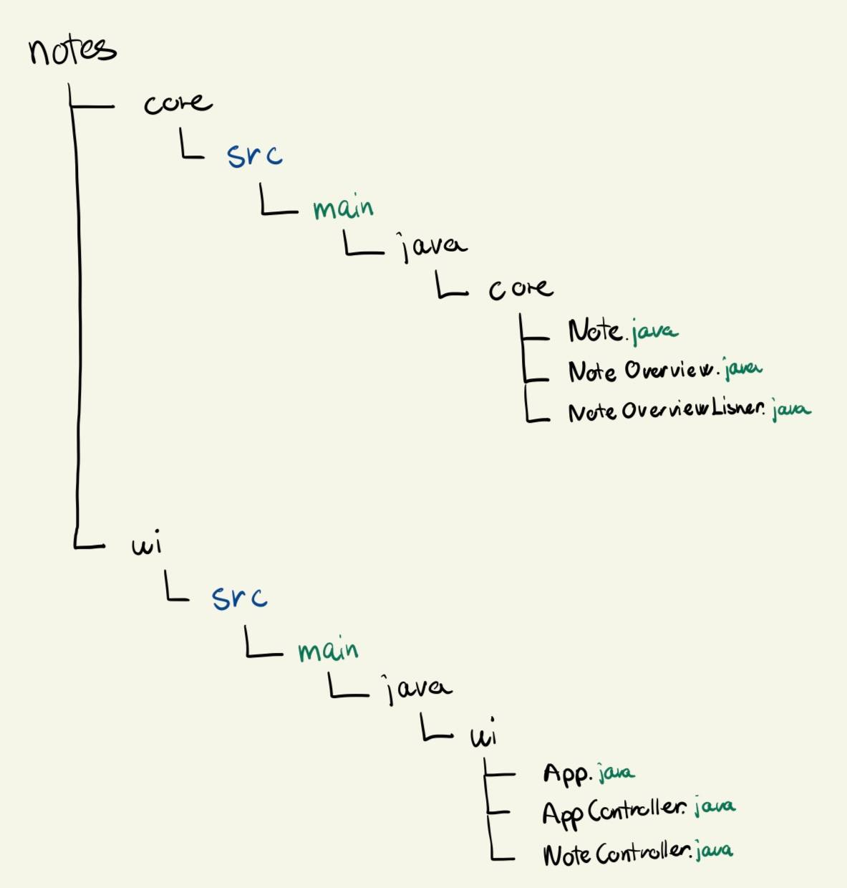

## Description of the Notes-App

The Notes-App is a simple application designed to help users create, edit, and manage their notes. For a more detailed description, please refer to this README file [this README file](/notes/core/README.md).

## Project Structure

The coding projekt is located in the notes folder, which you can access with `cd notes` from root level. 

The coding project is organized as follows:

- The core logic of the project is located in the `notes/ui/src/main/java/core` directory.

- The user interface of the project is located in the `notes/ui/src/main/java/ui` directory.

Here is a image of the project structure:

The app is build with Maven standard directory layout, and we use Maven commands to run the project. You can find more information about this in[README.md in notes](/notes/core/README.md).

