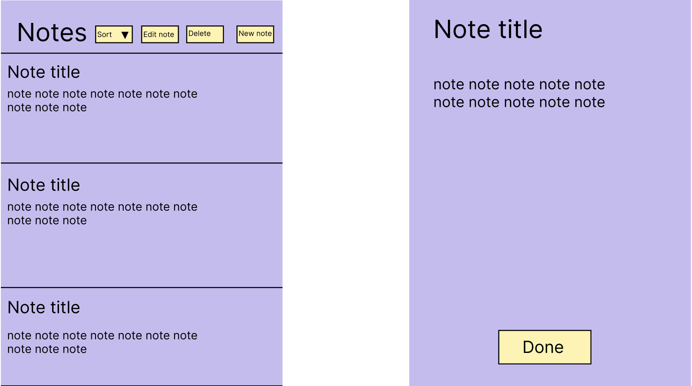

# Notes description 

Our app is an intuitive note-taking application designed for ease and efficiency. Users can swiftly create new notes, and when they return, making modifications or deleting notes is easy. All notes are initially presented in a clear list, organized chronologically based on their creation date. To cater to individual preferences, we've incorporated a sorting feature. Users can choose to sort their notes based on 'Created Date', 'Last Edited Date', or alphabetically by 'Title (A-Z)'. This added functionality ensures that users have quick access to their information, streamlining their note management process.

The app has two main functions

 - Creating notes
- Editing notes
- Deleting notes
- Sorting the list of notes

## The application




## JSON File Format

Our project utilizes JSON (JavaScript Object Notation) as the data interchange format for storing and retrieving information. JSON is a lightweight and human-readable data format that is widely supported in various programming languages. This section provides an overview of the JSON file format used in our project.

### File Structure

In our project, JSON files are structured as follows:

```
{"title":"Titel ","text":"text", "created":"createdDate","edited":"editedDate"}

```

## User Stories
User Stories can you find [here](../notes/UserStories.md). They are linked up with the issues in GitLab.


