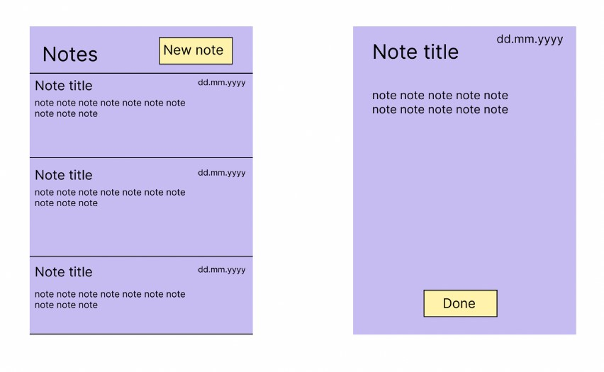

# Notes description 

Our app is an intuitive note-taking application designed for ease and efficiency. Users can swiftly create new notes, and when they return, making modifications or deleting notes is easy. All notes are initially presented in a clear list, organized chronologically based on their creation date. To cater to individual preferences, we've incorporated a sorting feature. Users can choose to sort their notes based on 'Created Date', 'Last Edited Date', or alphabetically by 'Title (A-Z)'. This added functionality ensures that users have quick access to their information, streamlining their note management process.

The app has two main functions

 - Creating notes
- Editing notes
- Deleting notes
- Sorting the list of notes

## The application



## Build and running of project


To set up the project, you have to be in root level `GR2311` 

```
mvn clean install
```


To run the projekt, when in root level run:

```
cd ui
mvn javafx:run
```


## Testing of project

The project 

To run all tests, run: 

```
mvn test
```

To only run `graphical` test:

```
cd ui
mvn test
```

To only run `core` tests:

```
cd core
mvn test
```

## User Stories
User Stories can you find [here](../notes/UserStories.md). They are linked up with the issues in GitLab.


